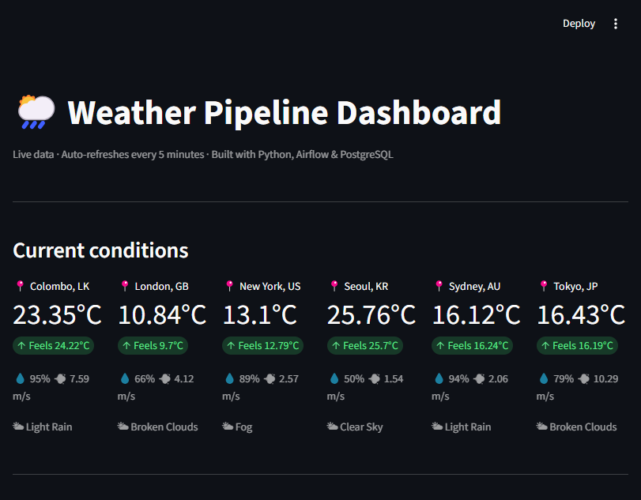

# 🌦️ Weather Pipeline




An automated end-to-end data engineering pipeline that collects live
weather data for multiple global cities, transforms and stores it in PostgreSQL,
and visualises it using a dashboard.

---

## 🏗️ Architecture

OpenWeatherMap API → Python Extract → Python Transform → PostgreSQL → Dashboard  
↑ orchestrated by Apache Airflow

---

## ⚙️ Tech Stack

| Layer | Tool |
|---|---|
| Ingestion | Python, Requests |
| Orchestration | Apache Airflow |
| Transformation | Python, Pandas |
| Storage | PostgreSQL |
| Infrastructure | Docker, Docker Compose |
| Workflow | Airflow DAGs |

---

## 📁 Project Structure

```bash
weather-pipeline/
├── dags/
│   └── weather_pipeline_dag.py
├── scripts/
│   ├── extract.py
│   ├── transform.py
│   ├── load.py
│   └── dashboard.py
├── raw_data/
├── clean_data/
├── logs/
├── docker-compose.yml
├── requirements.txt
├── .env.example
└── README.md
```

---

## 🚀 Features

- Extracts live weather data from OpenWeatherMap API
- Processes multiple cities automatically
- Stores raw JSON responses
- Transforms nested JSON into analytical tabular data
- Loads cleaned data into PostgreSQL
- Fully orchestrated using Apache Airflow
- Dockerized infrastructure
- Automatic scheduling support
- Logging and error handling

---

## ⚡ How To Run

### 1. Clone Repository

```bash
git clone https://github.com/Imasha-Samarasinghe/weather-pipeline.git

cd weather-pipeline
```

---

### 2. Create Virtual Environment

```bash
python -m venv venv
```

Activate:

#### Windows

```bash
venv\Scripts\activate
```

#### Linux / Mac

```bash
source venv/bin/activate
```

---

### 3. Install Dependencies

```bash
pip install -r requirements.txt
```

---

### 4. Create `.env`

Create a `.env` file:

```env
OPENWEATHER_API_KEY=your_api_key_here

DB_HOST=localhost
DB_PORT=5432
DB_NAME=weather_pipeline
DB_USER=weather_user
DB_PASSWORD=weather_pass
```

---

### 5. Start Infrastructure

```bash
docker-compose up -d
```

---

### 6. Run ETL Pipeline Manually

```bash
python scripts/extract.py

python scripts/transform.py

python scripts/load.py
```

---

### 7. Open Airflow UI

Visit:

```text
http://localhost:8080
```

Login:

```text
Username: admin
Password: admin
```

---

## 📊 Example Data

| City | Temp °C | Humidity | Weather |
|---|---|---|---|
| Colombo | 26.6 | 95% | Light Rain |
| Tokyo | 21.5 | 70% | Thunderstorm |
| Seoul | 30.7 | 68% | Clear Sky |

---

## 🔑 API Source

Weather data provided by:

https://openweathermap.org/

---

## 👨‍💻 Author

Built by Imasha Samarasinghe as a hands-on Data Engineering portfolio project.